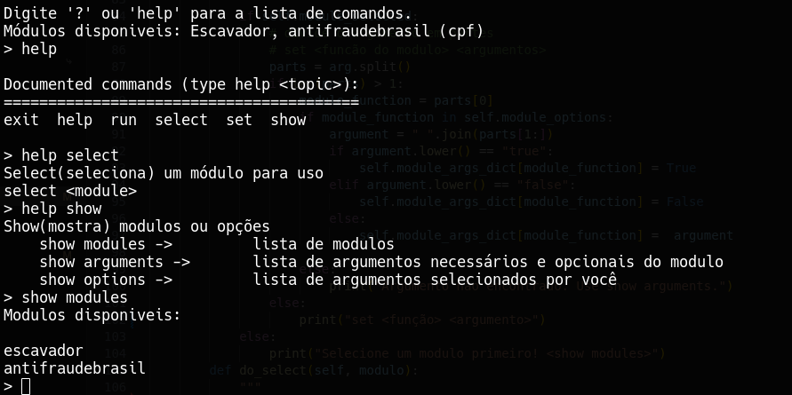

<h1 align="center" id="title">sozinho</h1>
<h3 align="center""><strong>sozinho® é uma ferramenta modular focada em automatizar pesquisas em fontes públicas (OSINT), com foco total no Brasil</strong></h3>
<hr>

<p align="center"></p><br>

> essa ferramenta é um protótipo do começo ao fim e tem o objetivo de ser experimental e uma base de aprendizado para projetos futuros.
> por esse e outros motivos — inexperiência —, estará sujeita a grandes mudanças durante o seu desenvolvimento.
<hr>

<h1 align="center">Instalação</h1>

```
$ git clone https://github.com/evildocument/sozinho.git
$ cd ./sozinho
$ python3 -m venv venv
$ source venv/bin/activate
$ pip3 -r requeriments.txt
$ playwright install
$ python3 sozinho.py
```

<p align="center">Para utilizar o módulo TudoSobreTodos é necessário ter uma instância do <a href="https://github.com/FlareSolverr/FlareSolverr/blob/master/docker-compose.yml">FlareSolverr</a> instalada.<br>A configuração padrão é recomendada para uma experiência out-of-the-box.</p>

<h1 align="center">Formas de uso</h2>

- É possível utilizar a ferramenta no console, selecionando o modo de pesquisa
> usando o help, é possível entender como todos os comandos disponiveis funcionam
```
$ python3 sozinho.py
```
<hr>
<p align="center"></p>

```
[sozinho]> help

Documented commands (type help <topic>):
========================================
exit  help  nome  set_flag

```

<p align="center"></p>

> set_flag serve para designar as flags para os modulos de busca

```
[sozinho]> set_flag
Argumentos
├── escavador
│   ├── name_in_sequence : False
│   └── state : None
└── tudosobretodos
    ├── verify : False
    ├── url : None
    ├── year : None
    ├── flareproxy : http://localhost:8191/v1
    ├── state : None
    ├── rate_limit : 3
    └── display_limit : 15
```

- Parar pesquisar, basta simplesmente informar o modo de pesquisa seguido de um espaço e da pesquisa

```
[sozinho]> nome exemplo da silva
```
<p align="center"></p><hr>

- ou, caso preferir, diretamente pela linha de comando
```
$ python3 -m modules.escavador --help
```
<p align="center"></p><hr>

